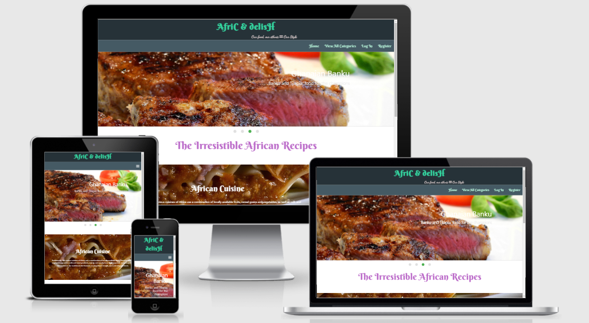

### **Website links:** 

*my github link*: [Rozdandy](https://github.com/Rozdandy/africadelishms3)

*Website Link*:

[Afric & delish](https://afric-delish.herokuapp.com/)

 There are about 55 countries on the African continent with a population estimated of 1.3 billion. Inspite of the numerous diverse cultures and ethnicities, the African cuisine or recipes is the least pronounced one among other continents of the world. For instance, here in the Netherlands, the African shops and restaurants that sell her recipes are very few in comparison to the asian continents. Does it mean other continents are not very aware of the African uncountable, tasty, relish, healthy, and energtic African recipes? In other instances, due to the diverse cultures and ethnicities, many indegenous African people are not aware of the various food recipes that available to them from other groups.

Therefore, Afric & delish is an online foodbook where users can surf other African recipes, able to register and also submit their country's cuisine. Afric & delish is a recipe website for people who love to explore continental dishes right in their homes. It avail the opportunity for gourmets and epicures to search for tasty, and palatable different African recipes to prepare for their maximum enjoyment. The concept of the foodbook would allow users to explore the available menus, create theirs, edit or update them and also delete them if they are not needed again. The concept of the   CREATE, READ, UPDATE and DELETE (CRUD) are the crux of the lecture for Milestone three Project at Code Institute, which this project would be built upon.

# **UX (USER EXPERIENCE)**

## Project objectives

This milestone project is a Data Centric Development module of [Code Institute](https://courses.codeinstitute.net/program/FullstackWebDeveloper)  classes. The aim is to "build an application that allow users to brows, store and access African recipes", using the CRUD operations.
In order to demonstrate these skills, I have decided to build this Afric & delish website, where Africans could perform the CRUD operations in order to furnish the site with different cuisnes in their countries for other people to emulates the methodologies of the same recipe.

## User stories

As a user, I would like to:
 

 *  view the site in any type of devices (mobile, tablet, desktop).
 *  view all recipes as a visitor.
 *  register to be a member and a regular user.
 *  be able to log in after registering
 *  view my own profile.
 *  add my recipes.
 *  see instructions on how to add a recipe.
 *  edit or update my recipes.
 *  delete my recipes that are not needed again.
 *  be able to log out.
 *  be able to search for recipes by names or description.
 *  see all the different categories of the recipes.
 *  know the particular African country which the recipe belongs to.
 *  recieve feedback if scuccessfully performed any of the CRUD operations.
 *  recieve an error message for perform the activities that is not within the scope of the website or there is an issue with database.

#### *Admin Objectives:*

In addition to the aforementioned user objectives above, as an Admin, i would like:

 *  be able add new categories and recipes.
 *  edit categories and recipes, in order to update them.
 *  delete categories, and recipes, in order to regulate and coordinates them.

### Developer objectives

 As a developer, to be able to demonstrate learnt skills in terms of:

 * providing a simple platform where users could perform CRUD operations.
 * good use of Jinja templating, Python, non-relational database MongoDb
 * good use materialize library combine with JavaScript knowledge.
 * how to make the website lives by deploying to Heroku.

## Design

The concept behind this site is just to enable individual culture and nations across Africa to showcase the various meal recipes in their countries for other people to reciprocate the methodologies. 

#### Fonts

[Google Fonts!](https://fonts.google.com/) Two main fonts were used for the whole sites:

* Supermercado for the body with fall back on san serif.
* Langar for the headers with fall back on san serif.

#### **Colour Scheme**

The developer used [eggradients](https://www.eggradients.com/shades-of-green-color) to choose colors when building the website. Particularly, the follwoing colors were used which are bright to make the site more appealling to sight:

 * #d32f2f (red color)
 * #455a64  (blue-grey color)
 * #263238  (blue-grey color )
 * #ba68c8 (purple color)
 * #69f0ae (green color)

 ## **Wireframe**

 [Balsamiq App](https://balsamiq.com/) was used for the design architechture and  the site mockups. Although, there were some minor changes in the design but mostly the layout on the app gave the guidance, a step by step guard to build the final website. Below is the link to the wireframe for the desktop and mobile device.

**View all**

 * [Wireframe](wireframe/ms3mockup.pdf)
        

# **FEATURES**

  **Existing Features**

### Register Account

* The registeration page allow intended users to register for free to create their own account. For security reason, there is a built-in authorization and    authentication  to check certain criteria to be met before an   account is validated. All passwords are hashed for further securities.

### Log In

* This is for users that registered, more authentication and authorization was embedded to check that the hashed passwords and username if they matched in the database.

### Log Out

* To enable users to log out of their accounts with a click of the button.

### View All Recipes

* On the All Recipes link on the Navbar, which will open All recipes page when clicked, it displays all the available recipes on the website.

### Search Recipes

* A user may want to search for a certain recipe by their name or by their description.

### Submit recipe

### Edit or Update Recipe

## Future Features to be Implemeneted

 * Pagination
 * Google login
 
 * To bind recipes to national related country
 * Lazy loading images
 * Prevent duplicate subscribers
 * User profiles with description, avatar, post list
 * Page loading animation
 * Subscription letters
 * Functionl emails
 * Admin console
 * Contact form and admin to be able to see all recieved messages directly in the admin console
 * Recipe image url validation
 * Sort recipes by tag, cousine, cook or prep time, even more specific dietary needs
 * Recipe Comments

# **TECHNOLOGY USED**

*The follwoing Technologies, Frameworks, and Libraries were used to build the project*  

### Tools  

* **Git**: It was used for version control which uses the Gitpod terminal to commit to Git and Push codes to GitHub
* **GitHub**:         [GitHub](https://github.com/) Developer used GitHub as a project repository to save.
* **Gitpod**:         [GitHub](https://www.gitpod.io/) The project used the Gitpod IDE as my workspace to develop the website. It is linked to GitHub repository to store data when coding.
* **Icons**:          [Font Awesome](https://fontawesome.com/) Social Media Icons were taken from this site.
* **Balsamiq**:       [Balsamiq](https://balsamiq.com/) The site was used to create the wireframes during the design stage of the project.

 ## Front-End Technologies

* [**HTML**](https://developer.mozilla.org/en-US/docs/Web/HTML): HTML/HTML5 the language used to create and as the markup text to add content to the website.  
* [**CSS**](https://developer.mozilla.org/en-US/docs/Web/CSS): It provides the styling for the website.
* [**jQuery 3.4.0**](https://jquery.com/) Used as the main JavaScript functionality.
* [materialize](https://materializecss.com/getting-started.html) Used to design the  mobile-first responsive layout for the website, forms and accordion.

## Back-End Technologies
*  Flask

    * [**Flask 1.0.2**](https://flask.palletsprojects.com/en/1.1.x/): A microframework used in python.
    * [**Jinja 2.10**](https://jinja.palletsprojects.com/en/2.10.x/):  Used for templating with Flask.
    * [**Werkzeug 0.16**](https://werkzeug.palletsprojects.com/en/0.16.x/): Used for password hashing, authentication, and authorization.

* Python

    * [**Python 3.6.7**](https://flask.palletsprojects.com/en/1.1.x/): The main back-end programming language.
    * [**MongoDB Atlas**](https://www.mongodb.com/): Used to store database in the cloud.
    * PyMongo
    
* Heroku

    * [**Heroku**](https://www.heroku.com/): Used to launch website.

* **CSS validator**:  [CSS validator](https://jigsaw.w3.org/css-validator/) The site was used to test for the validity of my CSS code. 
* **HTML validator**: [HTML validator](https://validator.w3.org/) The site was used to test for the validity of my HTML code.
* **Hover.css**:      [Hover.css](https://ianlunn.github.io/Hover/) The site was used on the navigation bar links and Social Media icons in the footer to create an hovering effects.
* **Balsamiq**:       [Balsamiq](https://balsamiq.com/) The site was used to create the wireframes during the design stage of the project.
* **freeformatter**:  [freeformatter](https://www.freeformatter.com/html-formatter.html) The site was used to format HTML.
* **Lighthouse**:     [Balsamiq](https://developers.google.com/web/tools/lighthouse/?utm_source=devtools) To audit the site perfomance and accessibility.
* **Am I Responsive?**:[Am I Responsive?](http://ami.responsivedesign.is/) It was used to test the responsiveness of the site and to take screenshot of devices.

# TESTING

***Sites Validation***

* [HTML-Validator](https://validator.w3.org/#validate_by_input"):  The site does not really understand the Jinja templating syntaxes, such as the   which resulted in many errors but outside that, all the codes worked perfectly.

* [Jshint](https://jshint.com/): When using the tool some warnings were flagged which mainly were the use of ES6 (use 'esversion: 6'). But the codes work perfectly however, i have taken note of that for next project.
[Javascript test](static/testing/jsms3.png).

* The [CSS validator](https://jigsaw.w3.org/css-validator/) was without any issues [CSS test](static/testing/cssms3.png).

* The [PEP*](http://pep8online.com/checkresult) was without any issues [PEP8 test](static/testing/pep8.png).

* Furthermore, the website was tested on the following: It works perfectly in them.

      * Systems: Macbook Pro Laptop, HP laptop, and Lenovo laptop.
      * Browsers: Chrome, Opera, Edge, Firefox, Safari
      * Phones and Tabs: iPad Pro, different Iphone series and androids

## **Testing user stories from UX section**

#### First-time visitors goals:

1. As a visitor, I want to be able to view the site in all modern devices, such as the desktop, tablet and mobile etc.

      * The visitor can visite the website on computer, laptop, tablet and phone.

2  Able to see all recipes as a visitor

    * The vistors can navigate through the site form the homepage with the navbar. 
    * The navbar is at the top of the site. They niew the whole recipes by click on the "View all categories" link in the navbar
    * There is a hamburger menu for the mobile view to aid navigations.
    * From the "View all categories" link , they can click on categories such breakfast menu, lunch etc.

3  Register to be a member and a regular user
    
    * The visitor can navigate to the register page by clicking on the "register" link on the navbar. 
    * There on the page, intended user can register.

4  To be able to log in after registeration

    * A user who has registered can easily log in from the navbar at the top of the site from any page by clicking on the "log in" link.
    * The page will open, Therefore, user can log in fully.

5. Able to search for recipes by names or description

    * This operation could be performed by both regular users and non-regulars
    * This can be achieved by clicking the "View All categories" button on the navbar.
    * There on the page the user can easily use the search engine to check for any particular recipe.

6. Able to search for recipes by names or description

    * This operation could be performed by both regular users and non-regulars
    * This can be achieved by clicking the "View All categories" button on the navbar.
    * There on the page the user can easily use the search engine to check for any particular recipe either by name or description.

7. Able to search for recipes categories

    * This operation could be performed by both regular users and non-regulars
    * This can be achieved by clicking the "View All categories" button on the navbar.
    * From the drop-downs, they can click on any category and the related recipes will be opened.

8. Able to know the particular African country which the recipe belongs to.

    * This operation could be performed by both regular users and non-regulars
    * This can be achieved by clicking on a particular recipe.
    * The information about the recipe is revealed which include the nationality of such cuisine

#### User/member goals:

9. View my own profile

    * Once a user, and has login, he/she is automatically taken to their profile page.
    * There, they can see all their recipes that they have posted and may want to post more by click on a CTA button.

10. Add my recipes

    * As as a user, he/she can post recipes, the option to post recipes is only available to users on the navbar.
    * A user can click on the link on the navbar and the page will open.
  

11.  To see instructions on how to add a recipe

    * Once the user click on the link "Add Recipe" from the navbar, the form will opened.
    * The input form is easy and direct to fill, and they can submit after filling in all the requirements by hitting the   green "ADD RECIPE" button.

12. To able to edit or update their recipes

    * This can be achieved when a user click on their posted recipes.
    * There is an option to edit at the bottom of the page for the said recipe.
    * When they click on the edit button, it takes them to form which is already pre-selected for the said recipe.
    * They choose to edit in or oder to update or just cancel to leave the recipe

